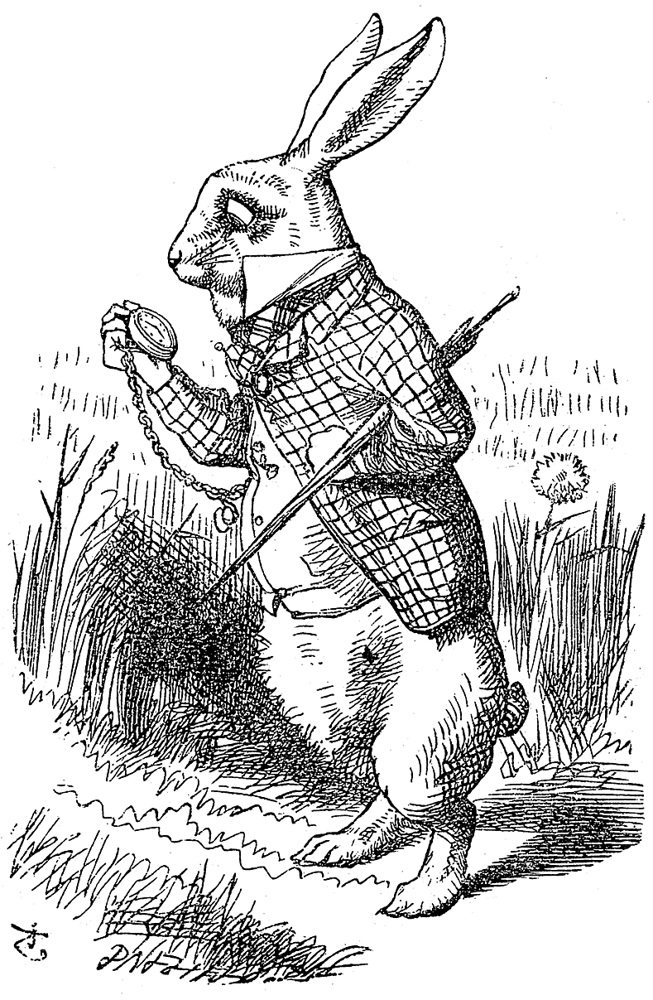

--------------------------------------------------------------------------------
marp: true
style: |-
  section {
    align-content: start;
    line-height: 1.8;

    font-family: 'Inter Variable';
    font-feature-settings: 'ss04' on;
  }

  section.title {
    align-content: center;
  }

  section.references {
    font-size: 16pt;
  }

  section.picture-frame {
    align-content: center;
    padding: 1em;
  }

  h1 { color: black; }

  :is(h1, h2, h3, h4, h5, h6) +
  :is(h1, h2, h3, h4, h5, h6) {
    margin-top: 0;
  }

  img[alt~="center"] {
    display: block;
    margin: auto;
  }

  footer, section::after {
    font-size: 14pt;
    color: gray;
  }

paginate: true
math: mathjax
--------------------------------------------------------------------------------

<!--
_class: title
_paginate: false
-->

# Marp Template

### Using Alice in Wonderland

Sooyoung Cheong
2025.01.15.

--------------------------------------------------------------------------------

## Down the Rabbit-Hole

Alice was beginning to get very tired of sitting by her sister on the bank, and of having nothing to do: once or twice she had peeped into the book her sister was reading, but it had no pictures or conversations in it, "and what is the use of a book," thought Alice, "without pictures or conversations?"

<!--
_footer: Caroll (1866)
-->

--------------------------------------------------------------------------------

<!-- 
_class: picture-frame
_footer: Tenniel (1866)
-->

--------------------------------------------------------------------------------

### References

Caroll, Lewis. Alice’s Adventures in Wonderland. Macmillan, 1866.

Tenniel, Sir John. The White Rabbit. 1866. In “Alice’s Adventures in Wonderland” (1866). [Link](https://commons.wikimedia.org/wiki/File:Alice-white-rabbit.jpg).

<!-- _class: references -->
